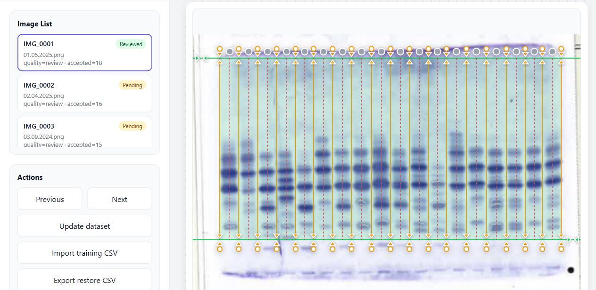
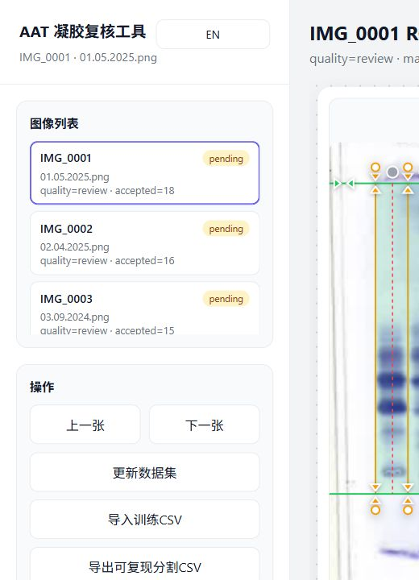
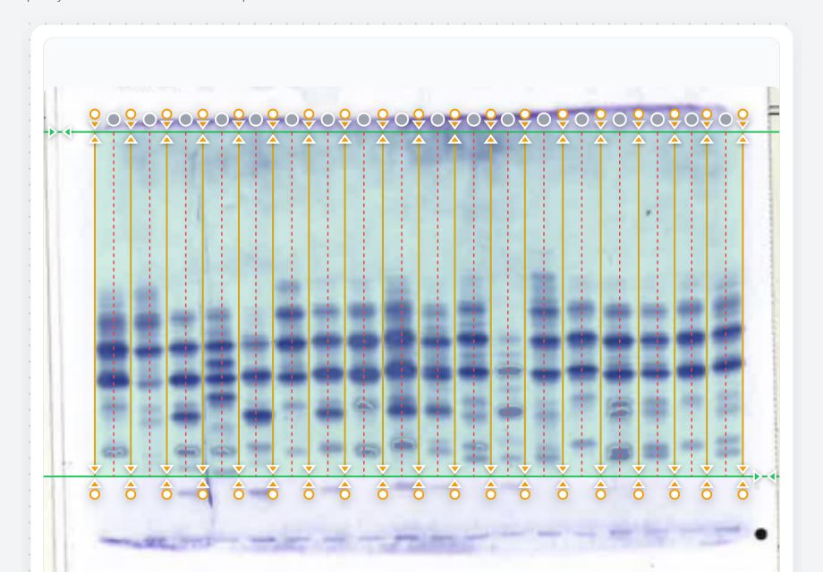
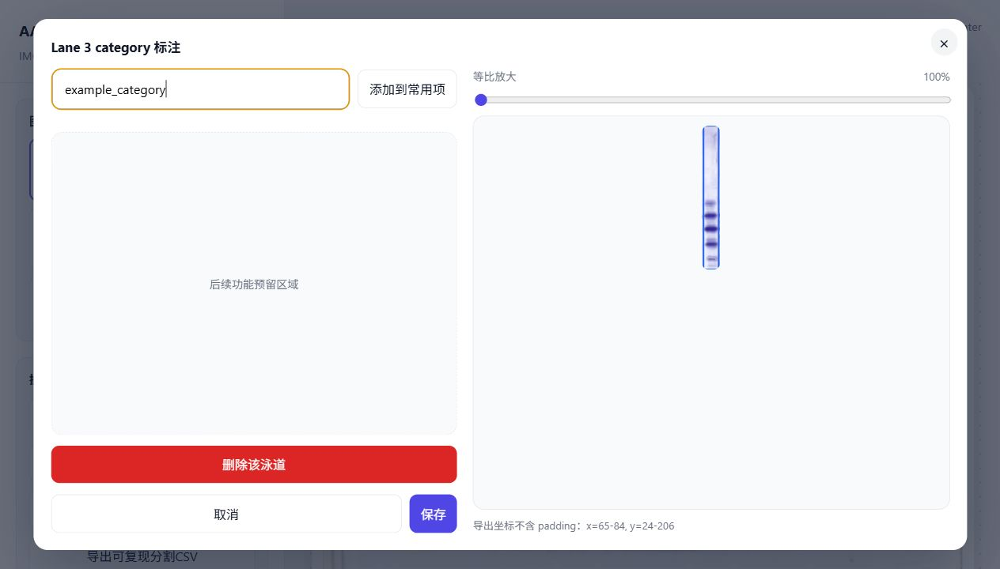
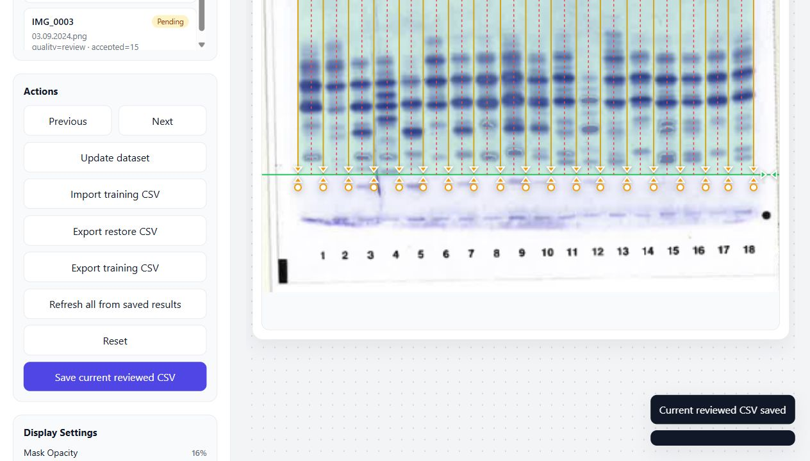

# AAT IEF Gel ROI/Lane Review Tool

Local research tool for reviewing automatic ROI and vertical lane segmentation on Alpha-1 Antitrypsin (AAT) isoelectric focusing (IEF) gel images.

This repository contains the code, configuration, and documentation needed to run the review tool. It does not include real gel images by default.

## What This Tool Does

- scans gel images placed in `dataset/Originial/`
- assigns stable `IMG_0001` style image IDs
- generates vertical projection metadata
- runs the v6 horizontal-ROI-aware lane boundary pipeline
- serves a local FastAPI and static Web review interface
- lets users adjust shared ROI and lane boundaries
- supports lane-level category annotation
- exports reviewed geometry and training CSV files

This is a human-in-the-loop research tool. It is not a clinical diagnostic device.

## Repository Layout

```text
Web/                  FastAPI backend and static review UI
scripts/              Dataset inventory, projection, segmentation, and overlay scripts
src/                  Shared image loading helpers
configs/              Segmentation pipeline configuration files
docs/                 User and data-policy documentation
dataset/Originial/    Place local gel images here; real images are ignored by Git
dataset/metadata/     Inventory and review metadata CSV files
outputs/              Generated automatic segmentation outputs; ignored by Git
```

## Requirements

- Windows 10/11 or equivalent Python environment
- Python 3.12 recommended
- A browser

Python dependencies are listed in `requirements.txt`.

## Quick Start

From the repository root:

```powershell
start_web.bat
```

Then open:

```text
http://127.0.0.1:8000
```

Manual setup is also supported:

```powershell
python -m venv .venv
.\.venv\Scripts\python.exe -m pip install -r requirements.txt
.\.venv\Scripts\python.exe -m uvicorn app:app --app-dir Web --host 127.0.0.1 --port 8000
```

## Screenshots

The screenshots below show the internal research review workflow with real example gel images from the private project environment. Raw source images are still excluded from Git.



Main review interface with the image list, automatic ROI, and lane boundary overlays.



The `Update dataset` action rescans local images and reruns the automatic v6 segmentation pipeline.



ROI and lane overlays are reviewed visually before being accepted as training or restore data.



Clicking a lane opens the annotation modal for category entry and lane-level inspection.



Reviewed geometry and lane annotations can be saved and exported from the action panel.

## Adding Images

1. Put supported image files into:

   ```text
   dataset/Originial/
   ```

2. Supported formats:

   ```text
   .png
   .jpg
   .jpeg
   .bmp
   ```

3. Open the Web tool and click `Update dataset`.

The update action rebuilds the inventory, creates conservative quality placeholders for new images, regenerates projection metadata, reruns v6 segmentation, and refreshes the Web image list.

## Review Workflow

1. Select an image from the left list.
2. Inspect automatic ROI and lane boundaries.
3. Drag ROI or lane boundaries if needed.
4. Click a lane to open the annotation modal.
5. Enter a lane category when known.
6. Save reviewed geometry.
7. Export restore or training CSV files when needed.

Reviewed outputs are written under:

```text
Web/review_exports/
```

These files are ignored by Git by default because they may contain research data.

## CSV Import and Export

- `review_restore_export.csv` is the reproducible segmentation file. Use `Export restore CSV` to create it, and `Import restore CSV` to restore reviewed ROI/lane geometry later.
- `lane_annotations_review.csv` is the lane-level annotation sidecar. Use `Import annotation CSV` when you only want to load category labels as a temporary edit session.
- `training_lanes_export.csv` is the downstream training table. It can also be imported as annotation input, but it is not the preferred restore file because its purpose is model training rather than full review-state recovery.
- `Refresh all from saved results` clears temporary imported annotation state and reloads the saved reviewed CSV files from `Web/review_exports/`.

## Command-Line Pipeline

The Web `Update dataset` button runs this sequence:

```text
scripts/build_image_inventory.py
scripts/generate_vertical_projections.py
scripts/detect_lane_roi_boundaries_v6.py
scripts/create_lane_roi_boundary_overlays_v6.py
```

The same scripts can be run manually from the repository root with the project virtual environment.

## Tests

Run:

```powershell
.\.venv\Scripts\python.exe -m unittest test_build_image_inventory.py test_dataset_refresh.py
```

## Data and Ethics

Real clinical or research gel images should not be committed to a public repository unless the responsible institution has approved sharing. See `docs/data_policy.md`.

## Current Maturity

The tool is suitable for internal research review and controlled collaboration. It still needs broader validation, stronger packaging, and clearer clinical governance before being treated as a mature external product. See `docs/tool_maturity_assessment.md`.

## Known Limitations

- Automatic v6 segmentation still requires human visual review.
- ROI placement can fail on images with strong headers, labels, page marks, or unusual crops.
- Lane category labels are user-supplied and not inferred clinically.
- The project does not currently provide a validated phenotype classifier.

## License

Choose and add a project license before public release.
